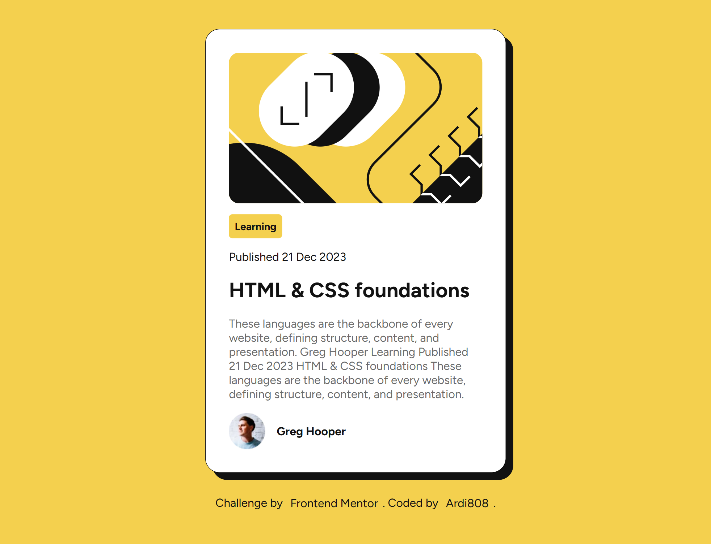

# Frontend Mentor - Blog Preview Card Solution

This is my solution to the [Blog Preview Card Challenge](https://www.frontendmentor.io/challenges/blog-preview-card-ckPaj01IcS) on Frontend Mentor.  
Frontend Mentor challenges help you improve your front-end skills by building realistic projects.

---

## 🧩 Overview

### The challenge

Users should be able to:

- See hover and focus states for all interactive elements on the page.
- View the layout optimized for different screen sizes (mobile & desktop).

---

### Screenshot

| Desktop View | Active State |
|---------------|--------------|
|  |  |

*(You can replace these images with your own screenshots later)*

---

### Links

- 💻 **Solution URL:** [https://www.frontendmentor.io/solutions/blog-preview-card-html-css-ardi808](https://www.frontendmentor.io/solutions/)
- 🌐 **Live Site URL:** [https://ardi808.github.io/blog-preview-card/](https://ardi808.github.io/blog-preview-card/)

*(Update the links above after you publish your project)*

---

## 💡 My process

### Built with

- Semantic **HTML5** markup  
- **CSS custom properties** (variables)  
- **Flexbox** for layout alignment  
- **Mobile-first** responsive design  
- **@font-face** for custom font import (Figtree)  

---

### What I learned

During this challenge, I improved my understanding of:

- Structuring semantic HTML using `<main>`, `<section>`, `<figure>`, and `<footer>`.
- Creating clean and consistent layouts using Flexbox.
- Using CSS custom properties (`:root`) to maintain color consistency.
- Implementing hover effects with smooth transitions.
- Adding subtle shadows and rounded corners to create depth and hierarchy.

Here’s an example of the hover effect I implemented on the title:

```css
.text .headline {
  font-size: 1.8rem;
  color: var(--Gray-950);
  transition: 0.2s;
}

.text .headline:hover {
  color: var(--Yellow);
}
